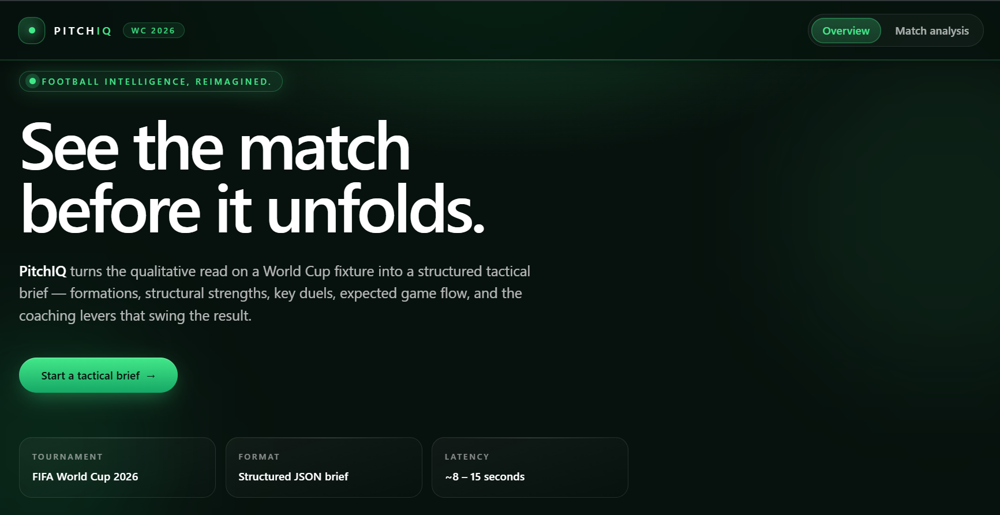

# PitchIQ

> Football Intelligence, Reimagined.

[](https://react.dev/)
[](https://www.typescriptlang.org/)
[](https://fastapi.tiangolo.com/)
[](https://ai.google.dev/)
[](https://firebase.google.com/)
[](https://cloud.google.com/run)
[](https://www.docker.com/)

<p align="center">
  
</p>

🌐 **Live Demo:** <https://pitchiq-ai.web.app>

PitchIQ is an AI-powered platform for football tactical intelligence that turns two FIFA World Cup 2026 teams into a structured pre-match tactical brief. The stack combines a React and TypeScript frontend with a FastAPI backend that uses Google Gemini to generate schema-validated analysis grounded in bundled World Cup data.

PitchIQ was conceived, designed, built, and deployed in a single day at Hack Days CUET, where it received the Google Cloud – Best Use of Google Cloud award. Since then, the core application and its architecture have remained the same; the repository has continued to mature through documentation, deployment refinement, production hardening, testing, and general code and repository quality improvements.

If you want to try it locally, start with the repository root and run `docker compose up --build`.

## Awards & Recognition

<p align="center">
  
</p>

PitchIQ received the Google Cloud – Best Use of Google Cloud award at Hack Days CUET.

**Hackathon Submission:** <https://devpost.com/software/pitchiq-5rblm7>

---

## Table of contents

1. [Awards & Recognition](#awards--recognition)
2. [Highlights](#highlights)
3. [Demo](#demo)
4. [How it works](#how-it-works)
5. [Architecture](#architecture)
6. [Repository layout](#repository-layout)
7. [Technology](#technology)
8. [Prerequisites](#prerequisites)
9. [Local setup](#local-setup)
10. [Environment variables](#environment-variables)
11. [API reference](#api-reference)
12. [Deployment](#deployment)
13. [Post-Deployment Verification](#post-deployment-verification)
14. [Deployment Best Practices](#deployment-best-practices)
15. [Testing & verification](#testing--verification)
16. [Status](#status)

---

## Highlights

- **Specialized AI role.** The system prompt casts Gemini as a *UEFA Pro Licensed Tactical Analyst* producing pre-match technical reports for professional coaches and broadcasters. No generic chat behaviour leaks into the response.
- **Grounded against real World Cup data.** Every prompt is injected with verified knowledge from `backend/knowledge/` — teams, confederations, groups, squads, fixtures, stadiums — so the model is anchored to factual reference instead of free-form invention.
- **Schema-validated, repair-aware.** Responses must match an explicit Pydantic schema. On validation failure the service automatically retries once with a *repair prompt* that includes the previous error and the rejected payload, then fails closed with a 502 if the model still can't comply.
- **Independent deployable halves.** React frontend on Firebase Hosting, FastAPI backend on Google Cloud Run. No serving of static assets from FastAPI, no long-lived state in the API.
- **Production hardening included.** CORS allow-list, structured error responses, immutable cache headers for hashed bundles in `frontend/nginx.conf`, SPA fallback via nginx, FastAPI health endpoint at `/health` (Cloud Run probe) plus an nginx-served `/healthz` for the frontend container, secrets via Secret Manager.
- **No live-knowledge claims.** The system prompt forbids inventing injuries, lineups, transfers, or live match facts. When personnel are uncertain the model describes the unit or role instead.
- **In-process result cache.** Analysis responses are cached in-process so identical matchup requests return in milliseconds on repeat calls; see [PROJECT_OVERVIEW.md](PROJECT_OVERVIEW.md#in-process-analysis-cache) for configuration knobs.

---

## Demo

The flagship demo is a single `POST /api/analyze` call for any of four flagship matchups:

| Matchup | Tactical angle |
| --- | --- |
| **Argentina vs France** | Possession positional play vs vertical transitions |
| **Brazil vs Germany** | Wide rotations vs compact mid-block pressing |
| **England vs Portugal** | Inverted fullbacks vs double-pivot counter-press |
| **Japan vs Morocco** | High-tempo circulation vs disciplined low block |

The frontend (`/analysis` route) renders the response as a tactical dashboard. Each card is independently composed and accessible:

- Formation strip for both sides
- Key battles with zone and edge indicators
- Tactical insights ranked by importance
- Game-flow narrative across opening, middle, and closing phases
- Coach recommendations with a decisive adjustment
- Four comparative score bars
  - Pressing
  - Possession
  - Attacking threat
  - Defensive stability

> The full tactical dashboard renders inline on the `/analysis` route; no screenshots are required to follow the walkthrough.

---

## How it works

```text
Browser
  │
  │  POST /api/analyze  { homeTeam, awayTeam }
  ▼
FastAPI route (thin HTTP controller)
  │
  │  validates AnalysisRequest
  ▼
AnalysisService  ←────  KnowledgeService (cached JSON files)
  │                       ├─ teams
  │                       ├─ groups
  │                       ├─ squads
  │                       ├─ fixtures
  │                       └─ stadiums
  │
  │  builds grounded football context
  │  loads prompt template (system + user)
  ▼
GeminiService  ──►  google-genai  ──►  gemini-2.5-flash
  │                                          │
  │                       JSON response ◄────┘
  ▼
AnalysisResponse.model_validate_json
  │
  ├── pass  → return to browser
  └── fail  → retry with repair prompt (max 2 attempts)
               │
               ├── pass  → return to browser
               └── fail  → 502 invalid_analysis_response
```

### Prompt design

Three versioned Markdown templates under `backend/app/prompts/`:

- **`tactical_analysis_system.md`** — Casts Gemini as the Tactical Analyst role, defines the JSON-only output contract, and states the no-invention rule for live facts.
- **`tactical_analysis_user.md`** — Interpolates `$home_team`, `$away_team`, and `$football_context` (the grounded knowledge block) into a structured analysis brief.
- **`tactical_analysis_repair.md`** — Re-issues the brief on retry with `$validation_error` and `$invalid_response` appended so the model can self-correct.

### Response schema

Every Gemini call returns JSON validated against `app/schemas/analysis.py`. Top-level fields:

| Field | Type | Constraint |
| --- | --- | --- |
| `matchOverview` | string | 12–700 chars |
| `homeTeam` / `awayTeam` | object | name + formation + playingStyle + tacticalIdentity |
| `predictedWinner` | string | exact home name, exact away name, or `Draw` |
| `confidence` | int | 0–100 |
| `formations` | object | home / away / matchup description |
| `strengths` / `weaknesses` | object | 2–4 entries per side |
| `keyBattles` | array | 3–5 entries, each with zone + home/away unit + edge (`home`/`away`/`even`) + analysis |
| `tacticalInsights` | array | 3–6 entries with title + detail + importance (`critical`/`high`/`medium`) |
| `expectedGameFlow` | object | opening / middle / closing phases |
| `coachRecommendation` | object | home + away + decisiveAdjustment |
| `pressingScore` / `possessionScore` / `attackingThreat` / `defensiveStability` | object | home + away, each 0–100 |

The schema also enforces a post-validation invariant: `homeTeam.name` and `awayTeam.name` must match the request, and `predictedWinner` must be one of the two requested names or `Draw`. Mismatches trigger the repair path.

### Knowledge layer

`KnowledgeService` reads five JSON files once and caches the parsed result in-process:

| File | Contents |
| --- | --- |
| `worldcup.teams.json` | 48 teams with FIFA codes, confederations, groups |
| `worldcup.groups.json` | 12 groups of 4 teams |
| `worldcup.squads.json` | Registered squads per team |
| `worldcup.stadiums.json` | Host venues and capacities |
| `worldcup.json` | Group-stage fixtures (group × round table) |
| `worldcup.quali_playoffs.json` | European / intercontinental qualifying playoff slots |

`FootballContextBuilder` queries only the two requested teams so prompts never leak unrelated information.

---

## Architecture

```text
┌─────────────────────────────────────────┐         ┌─────────────────────────────────────────┐
│  Firebase Hosting (frontend/dist)       │         │  Google Cloud Run (PitchIQ API)         │
│  ─────────────────────────────────────  │         │  ─────────────────────────────────────  │
│  React 19 + Vite 6 + TypeScript 5.8     │  HTTPS  │  FastAPI 0.115 + Pydantic 2             │
│  TanStack Query 5  │  React Router 7    │ ──────► │  Uvicorn (PORT env, non-root user)      │
│  Tailwind v4       │  Strict TS         │  JSON   │  Service layer                          │
│                                         │ ◄────── │    ├─ AnalysisService                   │
│                                         │         │    ├─ KnowledgeService (cached JSON)    │
│                                         │         │    ├─ FootballContextBuilder            │
│                                         │         │    └─ GeminiService → gemini-2.5-flash  │
└─────────────────────────────────────────┘         └─────────────────────────────────────────┘
                  ▲                                              ▲
                  │ build-time                                   │ runtime
                  │ VITE_API_BASE_URL                            │ GEMINI_API_KEY (Secret Manager)
                  │                                              │ CORS_ORIGINS, APP_ENV=production
                  │                                              │ GEMINI_MODEL, GEMINI_TIMEOUT_SECONDS
```

**Why this split?** Independent deploy lifecycles, no serving of static assets from the API, origin-restricted CORS, and a clean service-layer boundary that keeps Gemini behind an interface (`JsonGenerationService`) so the model can be swapped or stubbed in tests.

---

## Repository layout

```text
PitchIQ/                   ← repository folder (PitchIQ)
├── README.md                  ← you are here
├── AGENTS.md                  ← engineering guardrails
├── SKILL.md                   ← Codex / agent workflow
├── docker-compose.yml         ← local dev with healthcheck gating
├── firebase.json              ← SPA rewrite only
├── backend/
│   ├── Dockerfile             ← Python 3.12-slim, non-root, PORT env
│   ├── pyproject.toml
│   ├── requirements.txt
│   ├── requirements-dev.txt
│   ├── .env.example
│   ├── app/
│   │   ├── main.py            ← FastAPI app, CORS, exception handlers, startup log
│   │   ├── api/
│   │   ├── router.py      → /api mount
│   │   │   └── routes/
│   │   │       ├── analysis.py
│   │   │       └── health.py
│   │   ├── config/settings.py ← pydantic-settings, env-driven
│   │   ├── core/
│   │   │   ├── errors.py      ← AppError + Gemini/Analysis error subclasses
│   │   │   └── prompt_loader.py
│   │   ├── prompts/           ← versioned Markdown prompt templates
│   │   │   ├── tactical_analysis_system.md
│   │   │   ├── tactical_analysis_user.md
│   │   │   └── tactical_analysis_repair.md
│   │   ├── schemas/analysis.py
│   │   ├── services/
│   │   │   ├── analysis_service.py
│   │   │   ├── context_builder.py
│   │   │   ├── gemini_service.py
│   │   │   └── knowledge_service.py
│   │   └── knowledge/         ← bundled World Cup 2026 JSON
│   ├── tests/
│   │   ├── conftest.py
│   │   ├── test_api.py
│   │   ├── test_analysis_service.py
│   │   ├── test_context_builder.py
│   │   └── test_knowledge_service.py
│   └── scripts/
│       └── smoke_matchups.py  ← Phase 3 demo-day smoke runner
└── frontend/
    ├── Dockerfile             ← multi-stage: development / build / nginx production
    ├── nginx.conf             ← SPA fallback + /healthz + asset caching
    ├── package.json
    ├── vite.config.ts
    ├── tsconfig.json
    ├── index.html
    └── src/
        ├── main.tsx
        ├── app/
        │   ├── App.tsx
        │   ├── router.tsx
        │   └── providers/AppProviders.tsx
        ├── layouts/AppLayout.tsx
        ├── pages/
        │   ├── HomePage.tsx
        │   └── NotFoundPage.tsx
        ├── features/match-analysis/
        │   ├── MatchAnalysisPage.tsx
        │   ├── components/
        │   │   ├── MatchAnalysisForm.tsx
        │   │   ├── MatchAnalysisResults.tsx
        │   │   ├── MatchHeader.tsx
        │   │   ├── ScoreBar.tsx
        │   │   ├── FormationsSection.tsx
        │   │   ├── FactorsList.tsx
        │   │   ├── KeyBattles.tsx
        │   │   ├── TacticalInsights.tsx
        │   │   ├── GameFlow.tsx
        │   │   ├── CoachRecommendation.tsx
        │   │   ├── AnalysisLoadingState.tsx
        │   │   ├── AnalysisErrorState.tsx
        │   │   └── TeamPanel.tsx
        │   └── hooks/useMatchAnalysis.ts
        ├── services/analysisService.ts
        ├── types/analysis.ts
        └── styles/index.css
```

---

## Technology

| Layer | Stack |
| --- | --- |
| Frontend | React 19.1, Vite 6.3, TypeScript 5.8 (strict), TanStack Query 5.81, React Router 7, Tailwind CSS v4 |
| Backend | Python 3.12, FastAPI 0.115, Pydantic 2, pydantic-settings 2.10, Uvicorn 0.34 |
| AI | Google Gemini (`gemini-2.5-flash`) via `google-genai` 2.10, structured JSON output |
| Knowledge | Bundled FIFA World Cup 2026 JSON, parsed and cached in-process |
| Infrastructure | Docker, Docker Compose, Firebase Hosting, Google Cloud Run, Google Secret Manager |
| Testing | pytest 8, FastAPI `TestClient`, no network dependency |

---

## Prerequisites

- **Node.js** ≥ 22
- **Python** ≥ 3.12
- **Docker** with Docker Compose *(optional but recommended)*
- **Firebase CLI** and **Google Cloud CLI** *(only for deployment)*

---

## Local setup

### Option A — Docker Compose (recommended)

```bash
docker compose up --build
```

This starts both apps with hot-reload-friendly bind mounts. Open `http://localhost:5173`. The backend healthcheck gates the frontend so it never starts against a half-ready API.

### Option B — Manual

#### Frontend

```bash
cd frontend
cp .env.example .env
npm install
npm run dev          # http://localhost:5173
```

#### Backend (manual)

```bash
cd backend
python -m venv .venv
# activate .venv using your shell
pip install -r requirements-dev.txt
cp .env.example .env
# leave GEMINI_API_KEY blank to fail-closed; tests use a stub generator
uvicorn app.main:app --reload --port 8000
```

Interactive docs available at `http://localhost:8000/docs` in non-production environments.

---

## Environment variables

### Frontend (`frontend/.env`)

| Variable | Purpose | Example |
| --- | --- | --- |
| `VITE_API_BASE_URL` | Public backend origin, embedded in the browser bundle at build time | `http://localhost:8000` |

### Backend (`backend/.env`)

| Variable | Purpose | Default |
| --- | --- | --- |
| `APP_ENV` | Runtime mode (`development` enables `/docs`) | `development` |
| `CORS_ORIGINS` | Comma-separated allowed browser origins | `http://localhost:5173` |
| `PORT` | Container listening port (Cloud Run injects this) | `8080` |
| `GEMINI_API_KEY` | Gemini credential — empty disables the route, returns 503 | *empty* |
| `GEMINI_MODEL` | Gemini model identifier | `gemini-2.5-flash` |
| `GEMINI_TEMPERATURE` | Sampling temperature for analysis calls | `0.25` |
| `GEMINI_TIMEOUT_SECONDS` | Per-request HTTP timeout (5–300) | `45` |
| `GEMINI_MAX_VALIDATION_ATTEMPTS` | Retries before failing closed | `2` |

> Never commit `.env` files. Store the production Gemini key in **Google Secret Manager** and inject it as a Cloud Run secret rather than a plain env var.

---

## API reference

Base path: `/api` (analysis route is mounted at the `/api` prefix by `backend/app/api/router.py`; health lives at the root)

### `POST /analyze`

Request:

```json
{ "homeTeam": "Argentina", "awayTeam": "France" }
```

Success response (`200`):

```json
{
  "data": {
    "matchOverview": "...",
    "homeTeam": { "name": "Argentina", "formation": "4-3-3", "playingStyle": "...", "tacticalIdentity": "..." },
    "awayTeam": { "name": "France",    "formation": "4-2-3-1", "playingStyle": "...", "tacticalIdentity": "..." },
    "predictedWinner": "Argentina",
    "confidence": 67,
    "formations":   { "home": "4-3-3", "away": "4-2-3-1", "matchup": "..." },
    "strengths":    { "home": ["..."], "away": ["..."] },
    "weaknesses":   { "home": ["..."], "away": ["..."] },
    "keyBattles":   [ { "zone": "...", "homePlayerOrUnit": "...", "awayPlayerOrUnit": "...", "edge": "home", "analysis": "..." } ],
    "tacticalInsights": [ { "title": "...", "detail": "...", "importance": "critical" } ],
    "expectedGameFlow":   { "openingPhase": "...", "middlePhase": "...", "closingPhase": "..." },
    "coachRecommendation": { "home": "...", "away": "...", "decisiveAdjustment": "..." },
    "pressingScore":      { "home": 64, "away": 58 },
    "possessionScore":    { "home": 60, "away": 52 },
    "attackingThreat":    { "home": 66, "away": 55 },
    "defensiveStability": { "home": 58, "away": 61 }
  },
  "model": "gemini-2.5-flash"
}
```

Error responses (all follow `{ "error": { "code": "...", "message": "..." } }`):

| Status | `code` | Trigger |
| --- | --- | --- |
| 422 | `invalid_request` | Pydantic body validation failed (missing fields, identical team names) |
| 502 | `invalid_analysis_response` | Model failed validation on every attempt |
| 502 | `gemini_unavailable` | Provider returned an error or empty body |
| 503 | `gemini_not_configured` | `GEMINI_API_KEY` is empty |

### `GET /health`

Returns `{ "status": "healthy", "service": "pitchiq-api" }`. This is the FastAPI health endpoint mounted at the root of `api_router`; it is what Cloud Run's container probe should target.

> The frontend nginx container also serves a lightweight `/healthz` route for its own platform probe — that endpoint is owned by the static site, not by the API.

---

## Deployment

> **See also:** [Post-Deployment Verification](#post-deployment-verification) and [Deployment Best Practices](#deployment-best-practices) for critical verification steps after deploying to production.

### Backend — Google Cloud Run

```bash
gcloud run deploy pitchiq-api \
  --source backend \
  --region YOUR_REGION \
  --allow-unauthenticated \
  --min-instances 1 \
  --max-instances 5 \
  --concurrency 10 \
  --timeout 120 \
  --set-env-vars APP_ENV=production,CORS_ORIGINS=https://pitchiq-ai.web.app \
  --set-secrets GEMINI_API_KEY=GEMINI_API_KEY:latest
```

`backend/Dockerfile` runs Uvicorn as a non-root user and reads `PORT` from the environment, so Cloud Run's injected port is honoured automatically.

#### Recommended Cloud Run sizing rationale

The four scaling flags above reflect a hobby-project trade-off: keep one instance warm so the first request after a quiet window doesn't pay the 4–8 s cold-start tax, cap concurrency at 10 because each `/api/analyze` spends ~10–40 s waiting on Gemini and queueing 80 of them only inflates tail latency, bound max-instances at 5 so a stray demo-day link can't burn through the free tier, and shorten the request timeout to 120 s (above the worst-case `2 × 45 s` Gemini orchestration path) so a stuck request fails fast instead of lingering for the default 300 s. CPU allocation, memory, vCPU count, and the single-Uvicorn-worker `CMD` in the Dockerfile are deliberately left at their defaults; revisit them after measuring real traffic.

### Frontend — Firebase Hosting

```bash
npm --prefix frontend run build
firebase use --add
firebase deploy --only hosting
```

Set `VITE_API_BASE_URL` to the deployed Cloud Run URL before building. `firebase.json` publishes `frontend/dist` and rewrites all client-side routes to `index.html` for SPA navigation. Hashed assets under `/assets/` are cached for one year with `immutable` *when served by the production nginx image* (`frontend/nginx.conf`); Firebase Hosting does not honor those headers, so configure caching in `firebase.json` if you switch hosts.

### Secret management

- Create the Gemini key as a Secret Manager secret named `GEMINI_API_KEY`.
- Grant the Cloud Run service account `secretmanager.secretAccessor` on that secret.
- Reference it via `--set-secrets` (shown above) so it never appears in the container's env in plaintext.

---

## Post-Deployment Verification

After deploying to Cloud Run and Firebase Hosting, verify the production setup with these steps:

### Backend Verification

```bash
# 1. Verify Cloud Run deployment succeeded
gcloud run services describe pitchiq-api --region YOUR_REGION

# 2. Check environment variables are set correctly
gcloud run services describe pitchiq-api --region YOUR_REGION \
  --format='value(spec.template.spec.containers[0].env)'

# 3. Verify health endpoint returns 200
curl -I https://YOUR_CLOUD_RUN_URL/health

# 4. Test CORS preflight for OPTIONS /api/analyze
curl -X OPTIONS https://YOUR_CLOUD_RUN_URL/api/analyze \
  -H "Origin: https://pitchiq-ai.web.app" \
  -H "Access-Control-Request-Method: POST" \
  -v

# Expected response: HTTP 200 with Access-Control-Allow-Origin header
```

### Frontend Verification

```bash
# 1. Verify frontend deployed to Firebase Hosting
firebase hosting:channel:list

# 2. Test SPA routing (should return index.html, not 404)
curl -I https://pitchiq-ai.web.app/analysis
curl -I https://pitchiq-ai.web.app/nonexistent-route

# 3. Verify health endpoint
curl -I https://pitchiq-ai.web.app/healthz
# Expected: HTTP 200 with "healthy"
```

### End-to-End Production Verification

```bash
# 1. Open https://pitchiq-ai.web.app in your browser
# 2. Fill the form with a valid matchup (e.g., Argentina vs France)
# 3. Click "Analyze Matchup"
# 4. Verify:
#    ✓ Dashboard loads within 30 seconds
#    ✓ No errors in browser console
#    ✓ All tactical cards populate with valid data
#    ✓ Team names match the request
#    ✓ Scores are in range [0, 100]
#    ✓ Network tab shows:
#      - POST /api/analyze → 200 with analysis data
#      - No CORS errors
```

### Troubleshooting Deployment Issues

| Issue | Diagnosis | Resolution |
| --- | --- | --- |
| CORS errors in browser console | `CORS_ORIGINS` does not include the Firebase domain | Update Cloud Run: `gcloud run services update pitchiq-api --set-env-vars CORS_ORIGINS=https://pitchiq-ai.web.app` |
| Backend returns 503 on `/api/analyze` | `GEMINI_API_KEY` not set or inaccessible | Verify secret: `gcloud secrets versions list GEMINI_API_KEY` and check service account permissions |
| Frontend SPA routes return 404 | `firebase.json` rewrite rule missing or incorrect | Verify `firebase.json` contains the SPA rewrite rule shown above |
| Backend takes >120 seconds to respond | Gemini provider latency or timeout | Check `GEMINI_TIMEOUT_SECONDS` (default 45 s per request, max 2 attempts = 90 s + overhead) |
| Cold-start latency on first request | Cloud Run instance warming up | Expected behavior; `--min-instances 1` keeps one warm. Monitor with Cloud Run metrics. |

---

## Deployment Best Practices

### Before Every Backend Deployment

- **Update `CORS_ORIGINS`** if the Firebase Hosting domain changes (e.g., after switching projects or enabling preview channels). The frontend origin must be in `CORS_ORIGINS` before the backend is deployed.
- **Verify `GEMINI_API_KEY` exists** in Google Secret Manager with the correct name. Misspelled secret names cause silent 503 errors.
- **Test locally** with `docker compose up` to catch configuration errors before deploying.
- **Check Cloud Run quotas** to ensure you have capacity for the desired resource allocation.

### Before Every Frontend Deployment

- **Set `VITE_API_BASE_URL`** to the correct Cloud Run URL (with trailing slash removed). Hard-coded URLs are burned into the bundle at build time.
- **Run `npm run build`** and test the production bundle locally with `npm run preview` to catch build-time errors.
- **Verify `firebase.json` SPA rewrite rule** is present and targets `/index.html` (not `/index.html.gz` or other variants).

### After Every Deployment

- **Run the end-to-end verification** steps above within 5 minutes of deploying. Production issues are easiest to debug while the deploy is fresh.
- **Check Cloud Run logs** for any errors: `gcloud run services logs read pitchiq-api --limit 50 --region YOUR_REGION`.
- **Monitor Cloud Run metrics** (CPU, memory, latency, error rate) in the Cloud Console.
- **Test from a different network** (e.g., mobile hotspot) to verify DNS and edge caching work correctly.

### Common Pitfalls

- **Forgetting to set `CORS_ORIGINS`** before deploying: Even if the backend is live, the browser will reject requests from unlisted origins.
- **Building frontend with old `VITE_API_BASE_URL`**: The frontend bundle is immutable once deployed. Changing the backend URL requires rebuilding and redeploying the frontend.
- **Using `http://` instead of `https://` in CORS origins**: Most CDNs and browsers reject mixed-origin requests. Always use `https://` in production.
- **Leaving `APP_ENV` as `development`**: The FastAPI docs endpoint (`/docs`, `/redoc`) is only disabled when `APP_ENV=production`. Exposing the docs in production can leak API details.
- **Not monitoring Cold Start latency**: A first request after ~15 minutes of inactivity will take 4–8 seconds. Plan your demo or monitoring accordingly.

---

## Testing & verification

**Backend**

```bash
cd backend
pytest                                  # run the full pytest suite
pytest --collect-only -q                # print the current test count
python scripts/smoke_matchups.py        # manual smoke runner (not part of pytest)
```

`scripts/smoke_matchups.py` exercises the full orchestration — service → context builder → prompt loader → Pydantic schema — using a deterministic stub generator. Invariants validated:

- Team name round-trip
  - `homeTeam.name` matches the request
  - `awayTeam.name` matches the request
- `predictedWinner ∈ {home, away, Draw}`
- All eight tactical scores are in `[0, 100]`
- Array length bounds
  - `keyBattles` length 3–5
  - `tacticalInsights` length 3–6
  - `strengths` length 2–4 per side
  - `weaknesses` length 2–4 per side
- A malformed Gemini payload is rejected with `AnalysisGenerationError` after exhausting retries

> The number of pytest cases changes as the suite grows. Use `pytest --collect-only -q` as the single source of truth; do not record a hard-coded count elsewhere.

**Frontend**

```bash
cd frontend
npm run typecheck      # strict TypeScript
npm run build          # Vite production build
```

### End-to-end readiness checklist

- [x] `pytest` green
- [x] `npm run typecheck` clean
- [x] `npm run build` clean
- [x] `scripts/smoke_matchups.py` PASS for all 4 matchups + rejection regression
- [x] `firebase.json` SPA rewrite verified (no cache headers; caching lives in `frontend/nginx.conf` for the Docker image)
- [x] Backend `Dockerfile` honours `PORT` env, non-root user
- [x] Frontend multi-stage `Dockerfile` injects `VITE_API_BASE_URL` at build time
- [x] `nginx.conf` SPA fallback + `/healthz` + immutable asset caching
- [x] CORS restricted to `GET`, `POST`, `OPTIONS`
- [x] Secrets kept out of the repo, deferred to Secret Manager

---

## Status

PitchIQ has reached a stable, production-ready milestone for its initial public release.
The current repository reflects a working end-to-end experience for tactical analysis, with verified frontend and backend delivery, deployment support, and a documented testing workflow.
